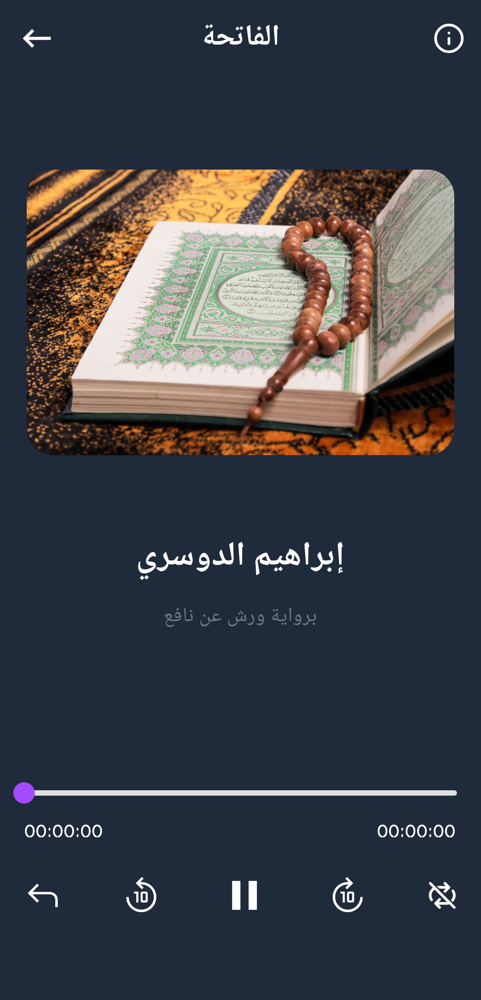

# Quran App v1.1.0

This application enables you to read and listen to the Holy Quran in several narrations by several reciters.
  

# 📸 Screenshots

  
  
  
  
  
  

   

# Download

You can download the APK directly in the releases section or 
via this link

- APK : https://bit.ly/QuranApp110
